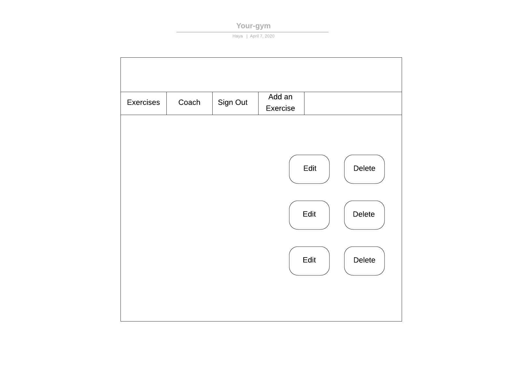
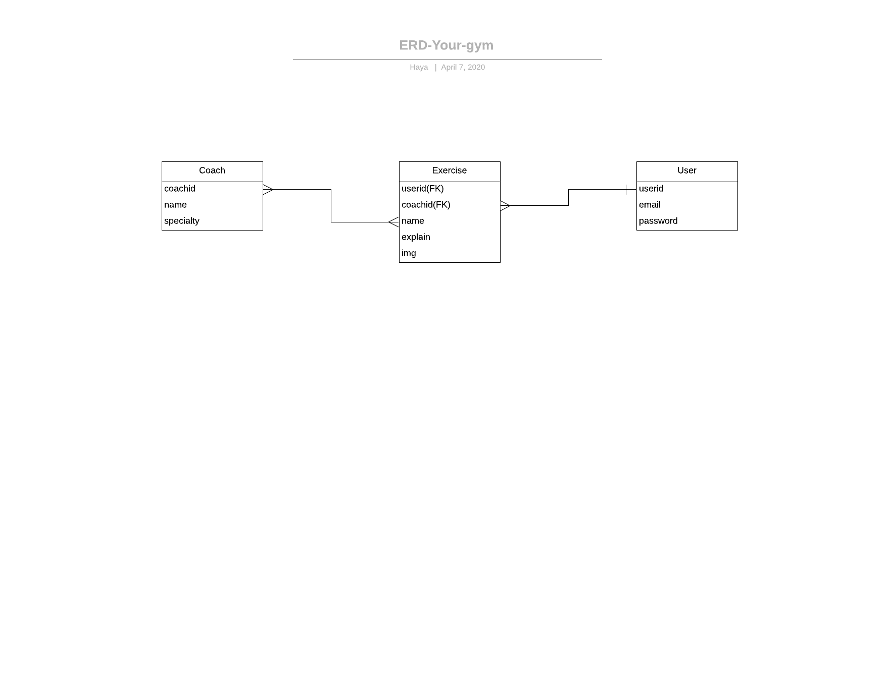

# YOUR_GYM
###  The idea of Project :
The project allows the user By adding exercise steps that he follows with pictures to Helps the user and coach follow the exercise steps
### Wireframes :

###  List of Technologies :
* Visual Studio Code
* Ruby.
* Rails.
* Bootstrap.
* PostgreSQL
* Scss
* Devise
 ### User Stories:
 User:
* As a User, I want to Login 
* As a User, I want to Logout   
* As a User, I want to view a single  Exercise  
* As a User, I want to view all Exercise  
* As a User, I want to create Exercise  
* As a User, I want to edit Exercise  
* As a User, I want to delete a Exercise  

Coach:

* As a Coach, I want to view a single  Coach 
* As a Coach, I want to view all Coach 
* As a Coach, I want to create Exercise 
* As a Coach, I want to delete a Exercise 
* As a Coach, I want to edit a Exercise 

 ### Project Development Plan :
* The Goals : Create a website without error both logical ,and technology.
* Objective : First , done all the basic requirement of project, and then add more features .
* Resources required : Keep on training.
* Measurement : Successful .
* Deadline : One week .

 ### Strategy of Project :
* First,search about ideas and choose the one 
* Draw the initial wireframe and Erd to figure out the requirement .
* Work in a sequence steps for both frontend and backend .
* Test the project step by step

### Future plans :
* Give the Coach access to the user’s account and add her note
* Improve design .
* More interactive .
* Add more features .